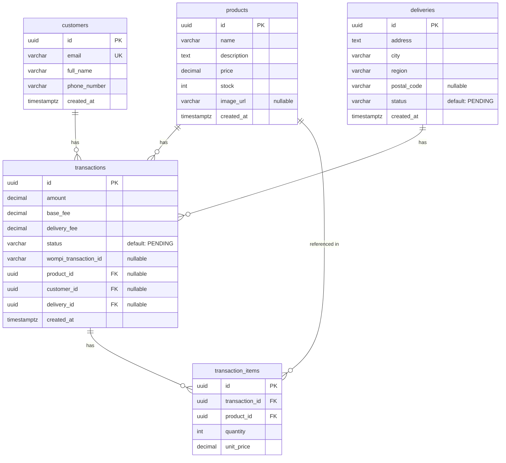

# 🐻 Oso's Pet Boutique — Checkout Payment System

> Technical test — FullStack checkout system integrated with Wompi payment gateway.

**Oso's Pet Boutique** is a specialized store selling **jackets for dogs and cats** 🐾. This application simulates the complete purchase flow with credit card payment through Wompi (sandbox).

> 🐶 *"Oso" is my dog, the inspiration and main image of this store.*

The system follows a **6-step process**: Product page → Product detail → Card & delivery info → Payment summary → Final status → Back to product with updated stock.

---

## 🎨 Visual Identity

| Attribute | Value |
|----------|-------|
| **Name** | Oso's Pet Boutique |
| **Mascot** | Oso 🐻 (dog) |
| **Product** | Jackets for dogs and cats |
| **Color palette** | Elegant purple/violet (`purple-600`, `indigo-900`) + dark tones + whites |
| **Style** | Premium, modern, mobile-first |

---

## 📑 Table of Contents

- [Tech Stack](#tech-stack)
- [Architecture](#architecture)
  - [Hexagonal Architecture (Ports & Adapters)](#hexagonal-architecture-ports--adapters)
  - [Folder Structure](#folder-structure)
- [Database Model](#database-model)
- [API Endpoints](#api-endpoints)
- [Frontend](#frontend)
  - [Business Flow (6 Steps)](#business-flow-6-steps)
  - [State Management](#state-management)
  - [Theme & Design](#theme--design)
- [Getting Started](#getting-started)
  - [Prerequisites](#prerequisites)
  - [Backend Setup](#backend-setup)
  - [Frontend Setup](#frontend-setup)
- [Testing](#testing)
- [Deployment](#deployment)

---

## 🛠 Tech Stack

### Backend
| Technology | Version |
|-----------|---------|
| [](https://nestjs.com/) | 11.x |
| [](https://www.typescriptlang.org/) | 5.7 |
| [](https://www.prisma.io/) | 7.9 |
| [](https://www.postgresql.org/) | (Supabase) |
| [](https://nodejs.org/) | 24.x |

### Frontend
| Technology | Version |
|-----------|---------|
| [](https://react.dev/) | 19.x |
| [](https://www.typescriptlang.org/) | 6.x |
| [](https://redux-toolkit.js.org/) | 2.12 |
| [](https://vitejs.dev/) | 8.x |
| [](https://tailwindcss.com/) | 4.x |

### Payment Gateway
| Service | Environment |
|---------|------------|
| [](https://docs.wompi.co/) | Sandbox (UAT) |

---

## 🏗 Architecture

### Hexagonal Architecture (Ports & Adapters)

The project follows **Hexagonal Architecture** (also known as *Ports & Adapters*) to keep business logic isolated from external concerns like databases, HTTP frameworks, and payment gateways.

```
┌─────────────────────────────────────────────────────────────────────┐
│                        INFRASTRUCTURE                              │
│  ┌──────────────────────────────────────────────────────────────┐  │
│  │  Controllers (HTTP)    │  Adapters (Prisma, Wompi, etc.)    │  │
│  └────────────────────────┴────────────────────────────────────┘  │
│                           │                                        │
│                    (depends on port)                                │
│                           ▼                                        │
├─────────────────────────────────────────────────────────────────────┤
│                        APPLICATION                                 │
│  ┌──────────────────────────────────────────────────────────────┐  │
│  │  Use Cases (business logic)     │  Common (Result<T,E>)     │  │
│  └──────────────────────────────────────────────────────────────┘  │
│                           │                                        │
│                    (depends on port)                                │
│                           ▼                                        │
├─────────────────────────────────────────────────────────────────────┤
│                          DOMAIN                                    │
│  ┌──────────────────────────────────────────────────────────────┐  │
│  │  Entities                     │  Ports (interfaces)         │  │
│  └───────────────────────────────┴──────────────────────────────┘  │
└─────────────────────────────────────────────────────────────────────┘
```

**Key principles applied:**
- **Domain layer** defines business entities and port interfaces (contracts)
- **Application layer** implements use cases with business logic, using the `Result<T,E>` pattern (Railway Oriented Programming)
- **Infrastructure layer** contains concrete implementations of ports (Prisma repositories, Wompi HTTP client, controllers)

### Folder Structure

```
checkout-payment-system/
│
├── checkout-backend/              # NestJS API
│   ├── prisma/                    # Prisma schema & migrations
│   │   └── schema.prisma          # Data model definition
│   ├── .ebextensions/             # AWS Elastic Beanstalk config
│   ├── Procfile                   # Elastic Beanstalk process file
│   └── src/
│       ├── domain/                # 👑 Domain layer
│       │   ├── entities/          #   Business entities
│       │   └── ports/             #   Repository interfaces
│       ├── application/           # ⚙️ Application layer
│       │   ├── common/            #   Shared utilities (Result<T,E>)
│       │   └── use-cases/         #   Business logic use cases
│       ├── infrastructure/        # 🔌 Infrastructure layer
│       │   ├── adapters/
│       │   │   ├── prisma/        #   Prisma service & repositories
│       │   │   └── wompi/         #   Wompi API client
│       │   └── controllers/       #   HTTP controllers
│       ├── app.module.ts          # Root module
│       ├── app.controller.ts      # Health check controller
│       ├── app.service.ts         # Health check service
│       └── main.ts                # Application entry point
│
├── checkout-frontend/             # React SPA
│   └── src/
│       ├── components/            # UI components
│       │   ├── cart/              # Cart-related components
│       │   ├── layout/            # Layout components (Header)
│       │   └── ui/                # Reusable UI components
│       ├── pages/                 # Page-level components
│       ├── store/                 # Redux store (5 slices)
│       ├── services/              # API client & env services
│       ├── types/                 # TypeScript type definitions
│       ├── App.tsx                # Root component
│       └── main.tsx               # Entry point
│
└── README.md                      # 📘 You are here
```

---

## 💾 Database Model

### Entity Relationship Diagram



---

## 📡 API Endpoints

| Method | Endpoint | Description | Status |
|--------|----------|-------------|--------|
| `GET` | `/` | Health check | ✅ |
| `GET` | `/products` | List all available products | ✅ |
| `POST` | `/transactions` | Create transaction & process payment | ✅ |
| `GET` | `/transactions/:id` | Get transaction status | ✅ |

---

## 🎨 Frontend

### Business Flow (6 Steps)

```
Step 1                    Step 2                    Step 3
┌─────────────┐          ┌─────────────┐          ┌─────────────┐
│  Product    │  ─────►  │  Product    │  ─────►  │  Card &     │
│  List       │          │  Detail     │          │  Delivery   │
│             │          │             │          │             │
│ • Products  │          │ • Full info │          │ • Card form │
│ • Stock     │          │ • Add to    │          │ • Address   │
│ • Price     │          │   cart      │          │ • Valid-    │
│ • Cart btn  │          │             │          │   ation     │
└─────────────┘          └─────────────┘          └─────────────┘
                                                  │
                                                  ▼
Step 6                    Step 5                    Step 4
┌─────────────┐          ┌─────────────┐          ┌─────────────┐
│  Product    │  ◄────  │  Payment    │  ◄────  │  Summary    │
│  List       │         │  Result     │         │  Payment    │
│  (updated)  │         │             │         │             │
│ • Stock     │         │ • Success   │         │ • Amount    │
│   updated   │         │   / Fail    │         │ • Base fee  │
│             │         │ • Updated   │         │ • Deliv fee │
│             │         │   stock     │         │ • Pay btn   │
└─────────────┘         └─────────────┘         └─────────────┘
```

**Detailed flow:**
1. **Product Page** — Browse available products with stock, price, and add-to-cart button
2. **Product Detail** — View full product details, add to cart with desired quantity
3. **Checkout Page** — Fill in credit card info and delivery address with validation
4. **Summary Page** — Review amount breakdown (subtotal, base fee, delivery fee) and confirm payment
5. **Result Page** — See transaction result (APPROVED / DECLINED / ERROR) with updated stock
6. **Back to Product Page** — Navigate back to browse products with updated stock quantities

### Theme & Design

- **Primary:** Elegant purple/violet (`purple-600`, `indigo-900`)
- **Background:** Dark tones and whites for premium contrast
- **Mobile-first:** Designed from iPhone SE (750x1334) upwards
- **Typography:** Modern and clean
- **Main image:** Oso 🐻, the store's mascot dog

### State Management

Redux Toolkit with 5 slices persisted via `redux-persist` in `localStorage`:

- **`cartSlice`** — Shopping cart items, quantities, and cart open/close state
- **`productsSlice`** — Product catalog, selected product, and stock updates
- **`paymentSlice`** — Card information, fees (base + delivery), and processing state
- **`deliverySlice`** — Customer info, delivery address, and terms acceptance
- **`transactionSlice`** — Transaction creation, status checking, and polling

> Persistence in `localStorage` for resilience against page refreshes.

---

## 🚀 Getting Started

### Prerequisites

- **Node.js** >= 20.x
- **npm** >= 10.x
- **PostgreSQL** database (Supabase)
- **Wompi Sandbox** keys

### Backend Setup

```bash
# 1. Navigate to backend
cd checkout-backend

# 2. Install dependencies
npm install

# 3. Configure environment (.env file)
#    DATABASE_URL, PORT, WOMPI_PUBLIC_KEY, WOMPI_PRIVATE_KEY, WOMPI_BASE_URL, WOMPI_INTEGRITY_KEY

# 4. Generate Prisma client
npx prisma generate
npx prisma db push

# 5. Start development server
npm run start:dev
# Server at http://localhost:3000
```

### Frontend Setup

```bash
# 1. Navigate to frontend
cd checkout-frontend

# 2. Install dependencies
npm install

# 3. Configure environment (.env file)
#    VITE_API_URL, VITE_WOMPI_PUBLIC_KEY, VITE_WOMPI_BASE_URL

# 4. Start development server
npm run dev
# App at http://localhost:5173
```

---

## 🧪 Testing

```bash
# Backend tests
cd checkout-backend && npm test
npm run test:cov

# Frontend tests
cd checkout-frontend && npm test
npm run test:cov
```

**Results:** Backend: 12 suites, 77 tests — 100% passing · Frontend: 15 suites, 140 tests — 100% passing

---

## ☁ Deployment

| Service | Provider | URL |
|---------|----------|-----|
| Frontend SPA | **Vercel** | [https://checkout-payment-system.vercel.app/](https://checkout-payment-system.vercel.app/) |
| Backend API | **Railway** | [https://checkout-payment-system-production.up.railway.app/](https://checkout-payment-system-production.up.railway.app/) |
| Database | **Supabase** (PostgreSQL) | — |
| Backend API (alt) | **AWS Elastic Beanstalk** | Config via `.ebextensions/` & `Procfile` |

---

## 🔗 Links

- **GitHub:** [https://github.com/nicolles1102/checkout-payment-system](https://github.com/nicolles1102/checkout-payment-system)
- **Frontend (Vercel):** [https://checkout-payment-system.vercel.app/](https://checkout-payment-system.vercel.app/)
- **Backend API (Railway):** [https://checkout-payment-system-production.up.railway.app/](https://checkout-payment-system-production.up.railway.app/)

---

> 💜 Made with love for Oso's Pet Boutique 🐾