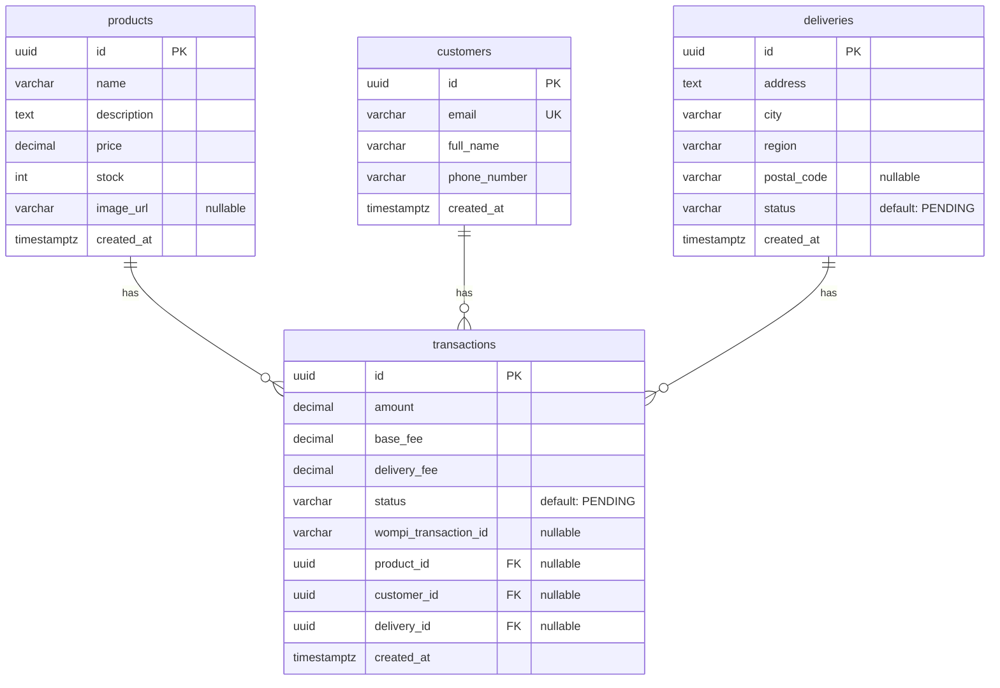

# 🐻 Oso's Pet Boutique — Checkout Payment System

> Technical test — FullStack checkout system integrated with Wompi payment gateway.

**Oso's Pet Boutique** es una tienda especializada en **chaquetas para perritos y gaticos** 🐾. Esta aplicación simula el flujo completo de compra con pago con tarjeta de crédito a través de Wompi (sandbox).

> 🐶 *"Oso" es mi perrito, la inspiración y la imagen principal de esta tienda.*

El sistema sigue un **proceso de 5 pasos**: Página de producto → Información de tarjeta y envío → Resumen de pago → Estado final → Volver a producto con stock actualizado.

---

## 🎨 Identidad Visual

| Atributo | Valor |
|----------|-------|
| **Nombre** | Oso's Pet Boutique |
| **Mascota** | Oso 🐻 (perrito) |
| **Producto** | Chaquetas para perros y gatos |
| **Paleta de colores** | Morado/violeta elegante (`purple-600`, `indigo-900`) + tonos oscuros + blancos |
| **Estilo** | Premium, moderno, mobile-first |

---

## 📚 Table of Contents

- [Tech Stack](#tech-stack)
- [Architecture](#architecture)
  - [Hexagonal Architecture (Ports & Adapters)](#hexagonal-architecture-ports--adapters)
  - [Folder Structure](#folder-structure)
- [Database Model](#database-model)
- [API Endpoints](#api-endpoints)
- [Frontend](#frontend)
  - [Business Flow (5 Steps)](#business-flow-5-steps)
  - [State Management](#state-management)
  - [Theme & Design](#theme--design)
- [Getting Started](#getting-started)
  - [Prerequisites](#prerequisites)
  - [Backend Setup](#backend-setup)
  - [Frontend Setup](#frontend-setup)
- [Testing](#testing)
- [Deployment](#deployment)
- [Evaluation Rubric Coverage](#evaluation-rubric-coverage)

---

## 🛠 Tech Stack

### Backend
| Technology | Version |
|-----------|---------|
| [](https://nestjs.com/) | 11.x |
| [](https://www.typescriptlang.org/) | 5.7 |
| [](https://www.prisma.io/) | 7.9 |
| [](https://www.postgresql.org/) | (Supabase) |
| [](https://nodejs.org/) | 24.x |

### Frontend
| Technology | Version |
|-----------|---------|
| [](https://react.dev/) | 19.x |
| [](https://www.typescriptlang.org/) | 6.x |
| [](https://redux-toolkit.js.org/) | 2.12 |
| [](https://vitejs.dev/) | 8.x |
| [](https://tailwindcss.com/) | 4.x |

### Payment Gateway
| Service | Environment |
|---------|------------|
| [](https://docs.wompi.co/) | Sandbox (UAT) |

---

## 🏗 Architecture

### Hexagonal Architecture (Ports & Adapters)

The project follows **Hexagonal Architecture** (also known as *Ports & Adapters*) to keep business logic isolated from external concerns like databases, HTTP frameworks, and payment gateways.

```
┌─────────────────────────────────────────────────────────────────────┐
│                        INFRASTRUCTURE                              │
│  ┌──────────────────────────────────────────────────────────────┐  │
│  │  Controllers (HTTP)    │  Adapters (Prisma, Wompi, etc.)    │  │
│  └────────────────────────┴────────────────────────────────────┘  │
│                           │                                        │
│                    (depends on port)                                │
│                           ▼                                        │
├─────────────────────────────────────────────────────────────────────┤
│                        APPLICATION                                 │
│  ┌──────────────────────────────────────────────────────────────┐  │
│  │  Use Cases (business logic)     │  Common (Result<T,E>)     │  │
│  └──────────────────────────────────────────────────────────────┘  │
│                           │                                        │
│                    (depends on port)                                │
│                           ▼                                        │
├─────────────────────────────────────────────────────────────────────┤
│                          DOMAIN                                    │
│  ┌──────────────────────────────────────────────────────────────┐  │
│  │  Entities                     │  Ports (interfaces)         │  │
│  └───────────────────────────────┴──────────────────────────────┘  │
└─────────────────────────────────────────────────────────────────────┘
```

**Key principles applied:**
- **Domain layer** defines business entities and port interfaces (contracts)
- **Application layer** implements use cases with business logic, using the `Result<T,E>` pattern (Railway Oriented Programming)
- **Infrastructure layer** contains concrete implementations of ports (Prisma repository, Wompi HTTP client, controllers)

### Folder Structure

```
checkout-payment-system/
│
├── checkout-backend/              # NestJS API
│   ├── prisma/                    # Prisma schema & migrations
│   │   └── schema.prisma          # Data model definition
│   ├── generated/                 # Generated Prisma client
│   └── src/
│       ├── domain/                # 👑 Domain layer
│       │   ├── entities/          #   Business entities
│       │   └── ports/             #   Repository interfaces
│       ├── application/           # ⚙️ Application layer
│       │   ├── common/            #   Shared utilities (Result<T,E>)
│       │   └── use-cases/         #   Business logic use cases
│       ├── infrastructure/        # 🔌 Infrastructure layer
│       │   ├── adapters/
│       │   │   ├── prisma/        #   Prisma service & repositories
│       │   │   └── wompi/         #   Wompi API client
│       │   └── controllers/       #   HTTP controllers
│       ├── app.module.ts          # Root module
│       └── main.ts                # Application entry point
│
├── checkout-frontend/             # React SPA
│   └── src/
│       ├── components/            # UI components
│       ├── pages/                 # Page-level components
│       ├── store/                 # Redux store
│       ├── services/              # API client services
│       ├── App.tsx                # Root component
│       └── main.tsx               # Entry point
│
└── README.md                      # 📘 You are here
```

---

## 💾 Database Model

### Entity Relationship Diagram



---

## 📡 API Endpoints

| Method | Endpoint | Description | Status |
|--------|----------|-------------|--------|
| `GET` | `/` | Health check | ✅ |
| `GET` | `/products` | List all available products | ✅ |
| `GET` | `/products/:id` | Get product by ID | 🔜 |
| `POST` | `/transactions` | Create transaction & process payment | ✅ |
| `GET` | `/transactions/:id` | Get transaction status | ✅ |
| `POST` | `/customers` | Register customer info | 🔜 |
| `POST` | `/deliveries` | Create delivery record | 🔜 |
| `POST` | `/webhooks/wompi` | Wompi payment callback | 🔜 |

> 📌 **Postman Collection:** [Link pendiente]  
> 📌 **Swagger Documentation:** [Link pendiente]

---

## 🎨 Frontend

### Business Flow (5 Steps)

```
Step 1                    Step 2                    Step 3
┌─────────────┐          ┌─────────────┐          ┌─────────────┐
│  Product    │  ─────►  │  Credit     │  ─────►  │  Summary    │
│  Page       │          │  Card &     │          │  Payment    │
│             │          │  Delivery   │          │             │
│ • Product   │          │ • Card form │          │ • Amount    │
│ • Stock     │          │ • Address   │          │ • Base fee  │
│ • Price     │          │ • Valid-    │          │ • Deliv fee │
│ • "Pay"     │          │   ation     │          │ • Pay btn   │
└─────────────┘          └─────────────┘          └─────────────┘
       ▲                                                  │
       │                                                  ▼
       │                                          ┌─────────────┐
       │  ┌─────────────┐                          │  Payment    │
       │  │  Product    │  ◄────────────────────  │  Result     │
       └── │  Page      │     (redirect after      │             │
          │  (updated)  │       completion)         │ • Success   │
          │  • Stock    │                           │   / Fail    │
          └─────────────┘                           │ • Updated   │
               Step 5                              └─────────────┘
                                                       Step 4
```

### Theme & Design

- **Primary:** Violeta/Purple elegante (`purple-600`, `indigo-900`)
- **Background:** Tonos oscuros y blancos para contraste premium
- **Mobile-first:** Diseñado desde iPhone SE (750x1334) hacia arriba
- **Tipografía:** Moderna y limpia
- **Imagen principal:** Oso 🐻, el perrito mascota de la tienda

### State Management

Redux Toolkit con slices:
- **`productsSlice`** — Catálogo y stock
- **`paymentSlice`** — Datos de tarjeta y estado
- **`deliverySlice`** — Información de envío
- **`transactionSlice`** — Estado de la transacción

> Persistencia en `localStorage` para resiliencia ante refrescos de página.

---

## 🚀 Getting Started

### Prerequisites

- **Node.js** >= 20.x
- **npm** >= 10.x
- **PostgreSQL** database (Supabase)
- **Wompi Sandbox** keys

### Backend Setup

```bash
# 1. Navigate to backend
cd checkout-backend

# 2. Install dependencies
npm install

# 3. Configure environment (.env file)
#    DATABASE_URL, PORT, WOMPI_* keys (see .env.example)

# 4. Generate Prisma client
npx prisma generate
npx prisma db push

# 5. Start development server
npm run start:dev
# Server at http://localhost:3000
```

### Frontend Setup

```bash
# 1. Navigate to frontend
cd checkout-frontend

# 2. Install dependencies
npm install

# 3. Start development server
npm run dev
# App at http://localhost:5173
```

---

## 🧪 Testing

> ⚠️ Tests being implemented (target: >80% coverage)

```bash
# Backend tests
cd checkout-backend && npm test
npm run test:cov

# Frontend tests
cd checkout-frontend && npm test
```

---

## ☁ Deployment

> ⚠️ Deployment pending (AWS target)

| Service | Provider |
|---------|----------|
| Backend API | AWS (ECS / Lambda) |
| Frontend SPA | AWS (S3 + CloudFront) |
| Database | Supabase (PostgreSQL) |

---

## 📊 Evaluation Rubric

| Criteria | Points | Status |
|----------|--------|--------|
| README completed correctly | 5 | ✅ |
| Images that render fast & UI/UX | 5 | 🔜 |
| Full checkout functionality | 20 | 🔜 |
| API working correctly | 20 | ✅ |
| > 80% test coverage | 30 | 🔜 |
| Cloud deployment | 20 | 🔜 |
| **Total required** | **100** | **In progress** |

### Bonus

| Criteria | Points | Status |
|----------|--------|--------|
| OWASP / HTTPS / Security | 5 | 🔜 |
| Responsive design | 5 | 🔜 |
| CSS skills | 10 | 🔜 |
| Clean code | 10 | ✅ |
| Hexagonal Architecture | 10 | ✅ |
| Railway Oriented Programming | 10 | ✅ |
| **Total bonus** | **50** | |

---

## 🔗 Links

- **GitHub:** [https://github.com/nicolles1102/checkout-payment-system](https://github.com/nicolles1102/checkout-payment-system)
- **Postman:** [Link pendiente]
- **Live API:** [Link pendiente]
- **Live App:** [Link pendiente]

---

> � Hecho con amor para Oso's Pet Boutique — Wompi FullStack Technical Test